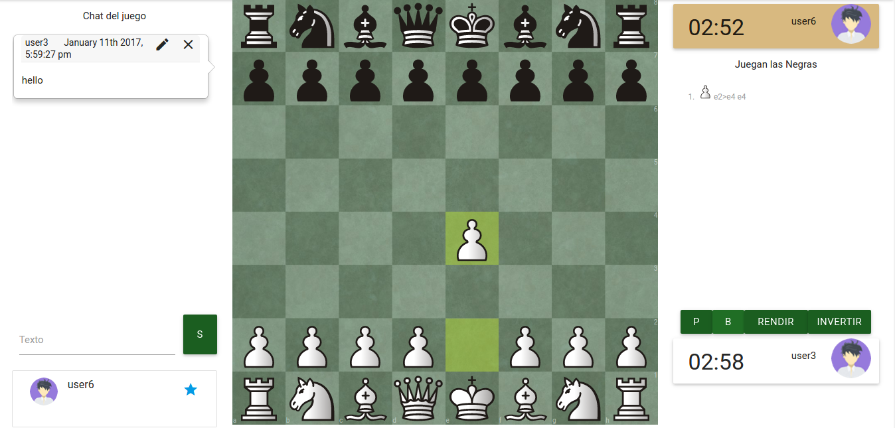
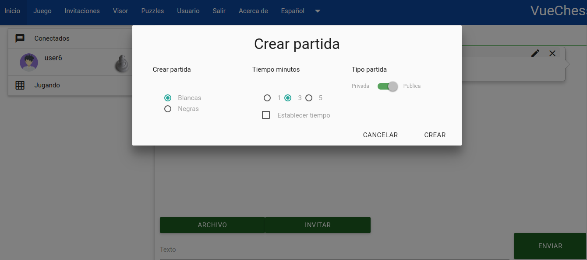
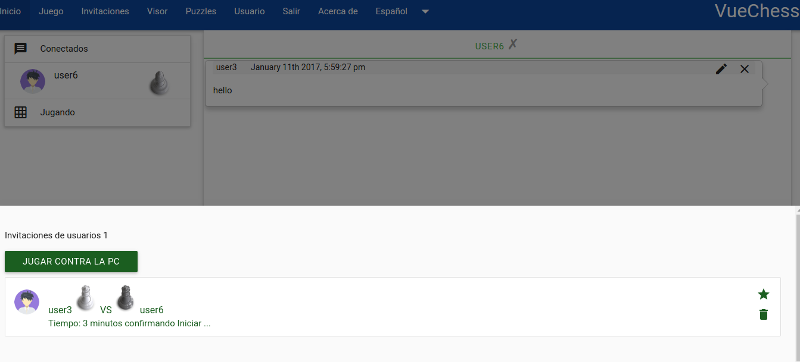
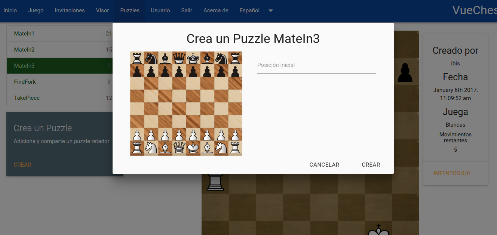
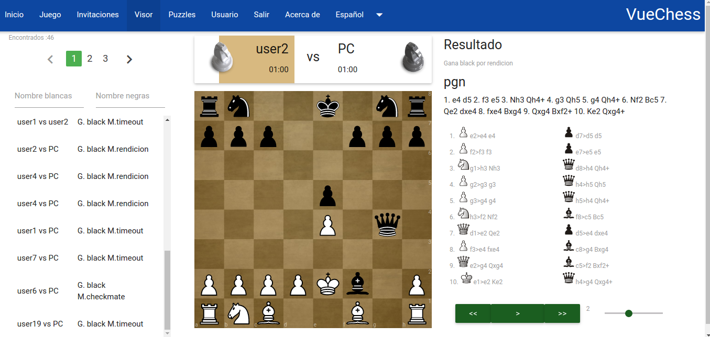
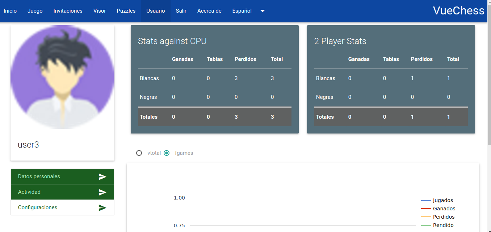

VueChess
========

 - Users can create private or public games against other  real-time
   player or against the computer by choosing color, time and type of
   starting, if public other users can view.
 - The user customize your board and pieces to taste.
 - Chat offers private chat with users connected well as file sharing in
   conversation and display items at that moment.
 - Viewer items which are searched using filters and reproduce items
   made by users.
 - *Solving puzzles:* authenticated users can solve puzzles registered in
   the system and add new ones, if the puzzle authorship is selected you
   can edit or delete.  


Images
------




")





*in progress*

Todo
------

- Load balancing work with redis. (Cooking with deepstream and nuxts)
- Load pgn file.

## Install nodejs and mongodb

        apt-get install nodejs-legacy npm
        apt-get install mongodb

## Run App

		node server
		// Get the address shown on console

## Build Setup

``` bash
# install dependencies
npm install

# After doing npm install copy from /copy_in_node_modules in /node_modules

cp -r -- copy_in_node_modules/ node_modules/

# serve with hot reload at localhost:8080
npm run dev

# run server in new tab

 node server

# Change the Dev variable in main.js to true

1. var Dev = true

# Accepts ssl certificate in localhost:(process.env.PORT || 3311)

# build for production with minification

# Change the Dev variable in main.js to false

npm run build

#Publish on server

rm -rf server/public/static
cp dist/static -r server/public/static
rm server/views/client.html
cp dist/index.html server/views/client.html


## Enjoy it
