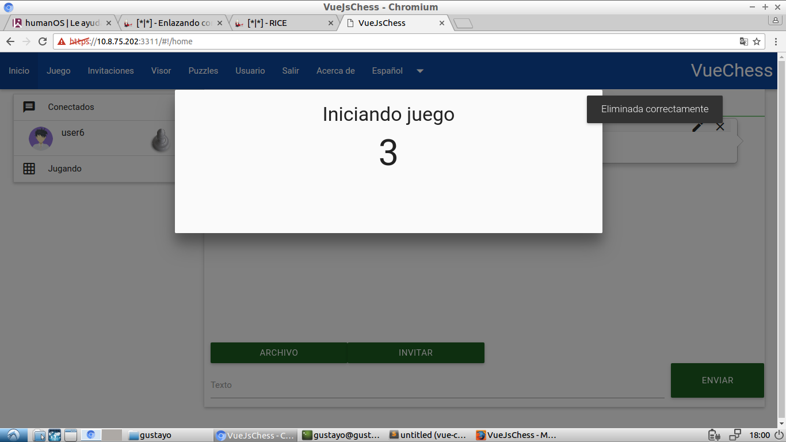

VueChess
========

 - Users can create private or public games against other  real-time
   player or against the computer by choosing color, time and type of
   starting, if public other users can view.
 - The user customize your board and pieces to taste.
 - Chat offers private chat with users connected well as file sharing in
   conversation and display items at that moment.
 - Viewer items which are searched using filters and reproduce items
   made by users.
 - *Solving puzzles:* authenticated users can solve puzzles registered in
   the system and add new ones, if the puzzle authorship is selected you
   can edit or delete.  


Images
------



")


*in progress*

Todo
------

- Load balancing work with redis.
- Load pgn file.

## Run App

		node server
		// Get the address shown on console

## Build Setup

``` bash
# install dependencies
npm install

# serve with hot reload at localhost:8080
npm run dev

# build for production with minification
npm run build

# run unit tests
npm run unit

# run e2e tests
npm run e2e

# run all tests
npm test
```


